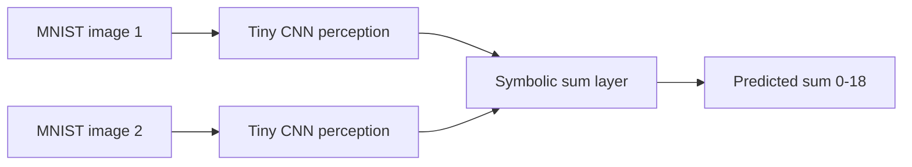
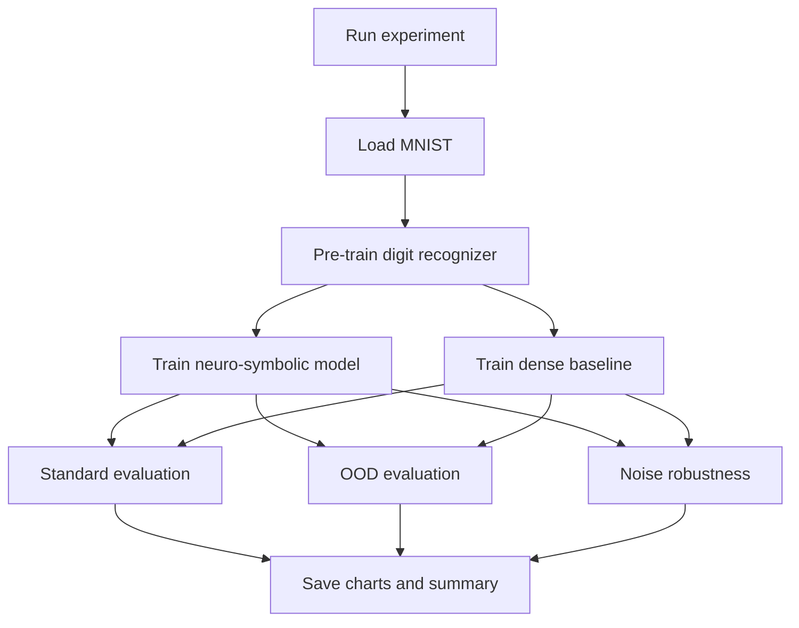

# MNIST Neuro-Symbolic Addition

A compact PyTorch project that compares two ways of solving MNIST addition:

- A neuro-symbolic model that first recognizes each digit and then adds the digit probabilities with a fixed symbolic rule.
- A dense neural baseline that predicts the sum directly from raw pixels.

The notebook in this repo is the exploratory version. The script in [nesy_addition.py](nesy_addition.py) is the clean, reproducible entry point.

## What this project shows

The idea is simple: split the problem into perception and reasoning.





## Repository layout

- [NeSy-Add.ipynb](NeSy-Add.ipynb): exploratory notebook with the original experiment.
- [nesy_addition.py](nesy_addition.py): reproducible script version with CLI options.
- [FINDINGS.md](FINDINGS.md): compact analysis of the real script outputs and what they mean.
- [noise_robustness_chart.png](noise_robustness_chart.png): chart produced in the notebook.
- [results/](results): output folder used by the script for generated figures and JSON summaries.
- [data/](data): MNIST files downloaded locally. This folder is ignored by Git.

## Latest observed results

The notebook in this workspace has already been executed, but the script in [nesy_addition.py](nesy_addition.py) is the canonical reproducible entry point. The current notebook snapshot and the full script run tell two slightly different stories, so both are documented here.

| Experiment | Neuro-Symbolic | Baseline |
| --- | ---: | ---: |
| Notebook snapshot: standard test split | 96.95% | 79.10% |
| Notebook snapshot: OOD digit-range split | 29.80% | 0.00% |
| Notebook snapshot: noise level 0.0 | 78.65% | 44.90% |
| Notebook snapshot: noise level 0.3 | 75.05% | 42.05% |
| Notebook snapshot: noise level 0.6 | 70.20% | 44.25% |
| Notebook snapshot: noise level 0.9 | 64.25% | 41.05% |
| Full script run: standard test split | 98.05% | 72.80% |
| Full script run: OOD digit-range split | 18.40% | 0.00% |
| Full script run: noise level 0.0 | 4.00% | 0.00% |
| Full script run: noise level 0.3 | 2.55% | 0.00% |
| Full script run: noise level 0.6 | 0.70% | 0.00% |
| Full script run: noise level 0.9 | 0.20% | 0.00% |

The notebook numbers come from the cells already saved in this workspace. The full script numbers come from running `python nesy_addition.py` in this repository after the clean rewrite. The gap between the notebook snapshot and the full script is explained by the different training budget and the fact that the script retrains fresh models before each evaluation block.

## How to run

Install dependencies:

```bash
pip install -r requirements.txt
```

Run a fast smoke test:

```bash
python nesy_addition.py --quick
```

The quick mode is only for verifying the pipeline. It is intentionally shorter and should not be used as the headline result in a paper or demo.

Run the full experiment:

```bash
python nesy_addition.py
```

The full experiment is the version to cite when you want the most defensible numbers.

Useful overrides:

```bash
python nesy_addition.py --standard-epochs 5 --ood-epochs 2 --output-dir results
```

## Outputs

The script writes these files into `results/`:

- `summary.json`
- `ood_accuracy_chart.png`
- `noise_robustness_chart.png`

## Why this version is easier to explain

- The perception model returns logits, so the pretraining step uses the correct loss function.
- The symbolic layer is explicit and small enough to describe in one paragraph.
- The baseline is a plain dense classifier, so the comparison is easy to understand.
- The README and charts separate the experiment story from the code.

## Findings map

- Standard MNIST addition is a sanity check: the neuro-symbolic path learns the arithmetic rule more cleanly than the dense baseline.
- The OOD split is the strongest compositionality test in the repo: the baseline falls to zero, while the neuro-symbolic model still keeps partial accuracy because the addition rule itself is fixed.
- The noise experiment isolates the perceptual bottleneck: once the digit recognizer is weak or undertrained, the symbolic layer cannot rescue the prediction.
- The main lesson is that the symbolic rule removes arithmetic ambiguity, but it does not remove dependence on digit recognition quality.

## Notes

- The data directory is local only; MNIST is downloaded automatically when needed.
- If you want to publish the project, commit the script, notebook, README, and generated figures, but keep the raw MNIST files out of Git.
