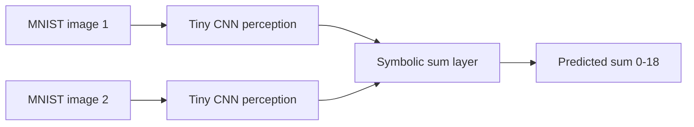
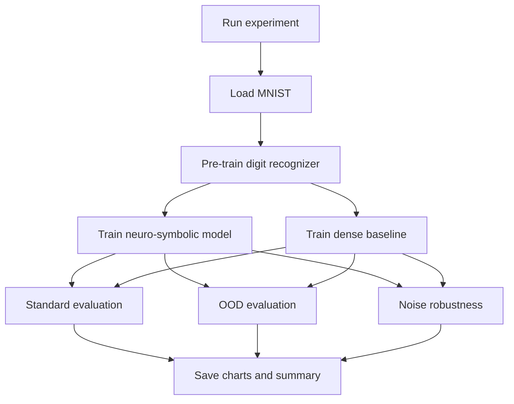

# MNIST Neuro-Symbolic Addition

A compact PyTorch project that compares two ways of solving MNIST addition:

- A neuro-symbolic model that first recognizes each digit and then adds the digit probabilities with a fixed symbolic rule.
- A dense neural baseline that predicts the sum directly from raw pixels.

The notebook in this repo is the exploratory version. The script in [nesy_addition.py](nesy_addition.py) is the clean, reproducible entry point.

## What this project shows

The idea is simple: split the problem into perception and reasoning.





## Repository layout

- [NeSy-Add.ipynb](NeSy-Add.ipynb): exploratory notebook with the original experiment.
- [nesy_addition.py](nesy_addition.py): reproducible script version with CLI options.
- [noise_robustness_chart.png](noise_robustness_chart.png): chart produced in the notebook.
- [results/](results): output folder used by the script for generated figures and JSON summaries.
- [data/](data): MNIST files downloaded locally. This folder is ignored by Git.

## Latest observed results

The notebook in this workspace has already been executed. The current stored results are:

| Experiment | Neuro-Symbolic | Baseline |
| --- | ---: | ---: |
| Standard test split | 96.95% | 79.10% |
| OOD digit-range split | 29.80% | 0.00% |
| Noise level 0.0 | 78.65% | 44.90% |
| Noise level 0.3 | 75.05% | 42.05% |
| Noise level 0.6 | 70.20% | 44.25% |
| Noise level 0.9 | 64.25% | 41.05% |

These numbers come from the notebook cells that are already saved in this workspace. The script will regenerate the same style of outputs when run with the same configuration and seed.

## How to run

Install dependencies:

```bash
pip install -r requirements.txt
```

Run a fast smoke test:

```bash
python nesy_addition.py --quick
```

Run the full experiment:

```bash
python nesy_addition.py
```

Useful overrides:

```bash
python nesy_addition.py --standard-epochs 5 --ood-epochs 2 --output-dir results
```

## Outputs

The script writes these files into `results/`:

- `summary.json`
- `ood_accuracy_chart.png`
- `noise_robustness_chart.png`

## Why this version is easier to explain

- The perception model returns logits, so the pretraining step uses the correct loss function.
- The symbolic layer is explicit and small enough to describe in one paragraph.
- The baseline is a plain dense classifier, so the comparison is easy to understand.
- The README and charts separate the experiment story from the code.

## Notes

- The data directory is local only; MNIST is downloaded automatically when needed.
- If you want to publish the project, commit the script, notebook, README, and generated figures, but keep the raw MNIST files out of Git.
